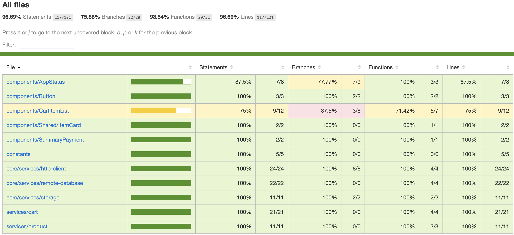

# Pastelaria do Arturito

 ## Itens desenvolvidos

 Teremos algumas telas como obrigatórias para a pontuação máxima do projeto. São elas:
- [X] Ícone personalizado para o app
- [X] Splash screen customizada
- [X] Login
  - [X] Tela com validações padrões nos inputs
  - [X] Firebase Auth implementado
- [X] Cadastro
  - [X] Validação de input de e-mail
  - [X] Validação de senha com no mínimo 6 caracteres
- [X] Home 
  - [X] Listagem de produtos via Firebase
  - [X] Tratamento de erro
  - [X] Tratamento de listagem vazia
- [X] Detalhes do produto
  - [X] Navegação com parâmetro (id do produto)
  - [X] Busca do produto no firebase
- [X] Carrinho
  - [X] Criação, listagem e atualização via Firebase
  - [X] Id do carrinho salvo no async storage
  - [X] Listagem de itens
  - [X] Tratamento de erro
  - [X] Tratamento de listagem vazia
- [X] Checkout
  - [X] Listagem e Seleção de endereço via Firebase
  - [ ] Excluir o endereço
  - [ ] Editar o endereço
- [X] Listagem dos métodos de pagamento
  - [X] Seleção do método de pagamento
- [X] Tela de pagamento 
  - [X] Tela de sucesso na finalização do pagamento (mockado)
- [ ] Tela de Perfil do usuário (não desenvolvida)
- [x] Listar endereços
  - [x] Listar os endereços cadastrados via Firebase
  - [ ] Excluir
  - [ ] Editar
  - [ ] Criar novo
- [ ] Formulário de endereço (não desenvolvido)
- [ ] Pedidos (não desenvolvido)
  - [ ] Produtos do pedido
  - [ ] Detalhes da entrega
  - [ ] Detalhes do pagamento

Estados globais da aplicação
- [X] Cart
- [X] Address
- [X] Products

- [X] Integração firebase
  - [X] Realtime database
  - [X] Firebase Auth

- [ ] Testes 
  - [X] Testes unitários
      - [X] Ver Imagem abaixo ou HTML do coverage com todos os items testados
  - [ ] Testes E2E (não desenvolvido)

## COVERAGE

